# avito-trainee-assignment

## Usage:

- `make init` - инициализация проекта, выполнение миграций, запуск в фоновом режиме
- `make stop` / `make run` - остановка / запуск контейнеров
- `make migrateup` / `make migratedown` - выполнение / откат миграций
- `make down` - удаление контейнеров

Для проверки достаточно будет использовать `make init`. Для удобства через миграции в бд уже вставлено несколько тегов, фич и баннеров.

## Checking endpoints:

- `Проверка прав`

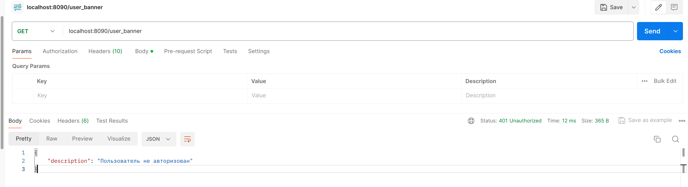

- `Получение контента баннера для пользователя`

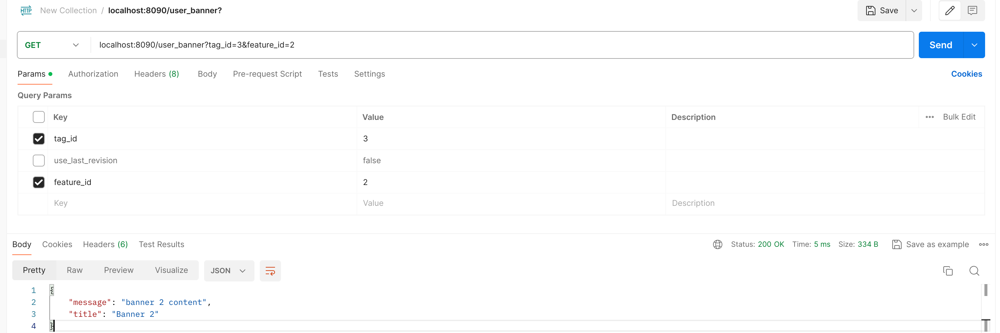

- `Получение списка баннеров с токеном пользователя`

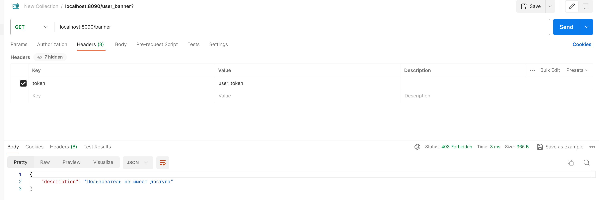

- `Получение списка баннеров с токеном админа`

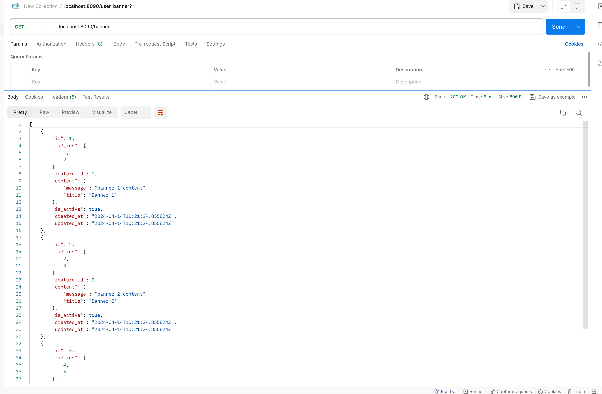

- `Получение списка баннеров с различными параметрами 1`

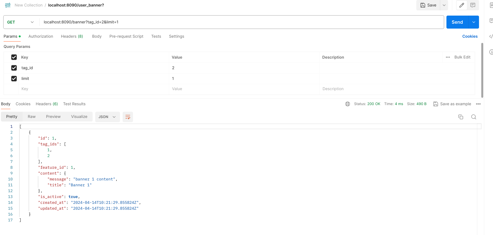

- `Получение списка баннеров с различными параметрами 2`

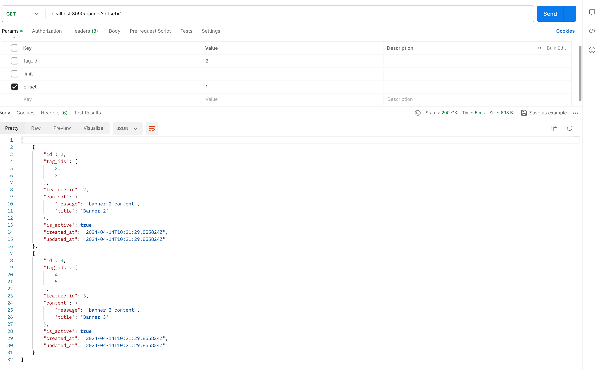

- `Создание нового баннера`

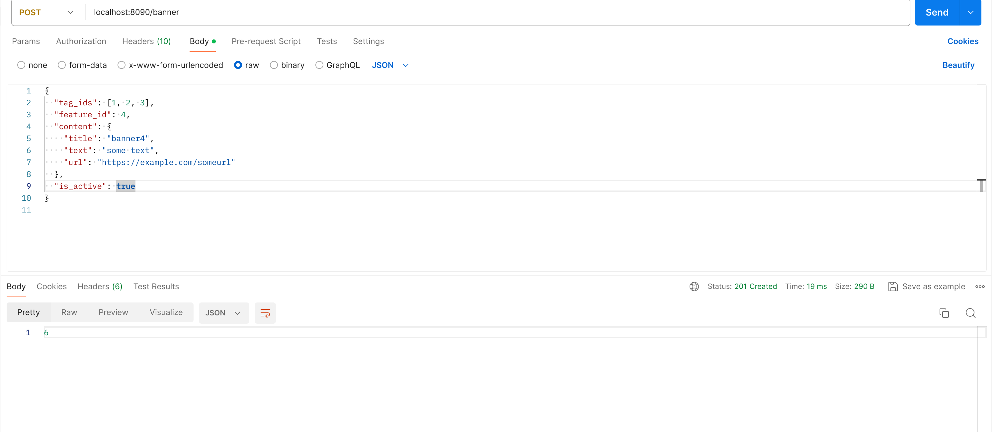

- `список баннеров после вставки`

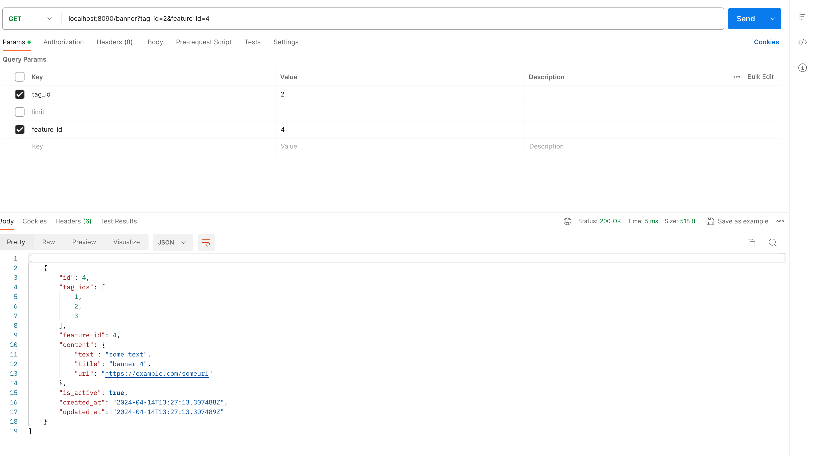

- `обновление созданного баннера`


- `список баннеров после вставки`


При обновлении указал флаг активности false.

- `Проверка доступа неактивного баннера для пользователя`

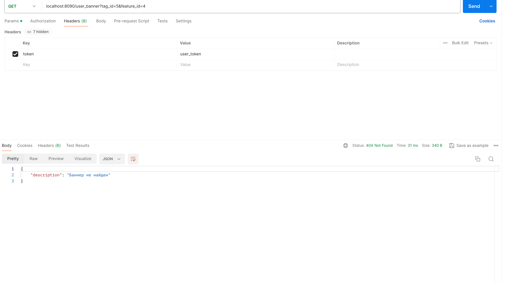

- `Проверка доступа неактивного баннера для админа`


- `Удаление баннера`

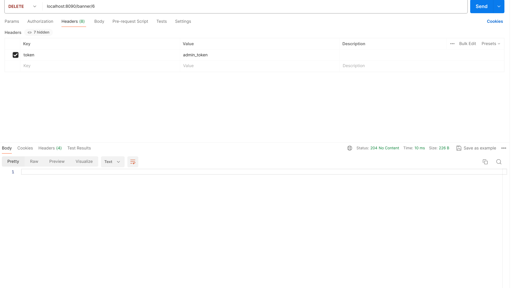

- `Баннеры после удаления `

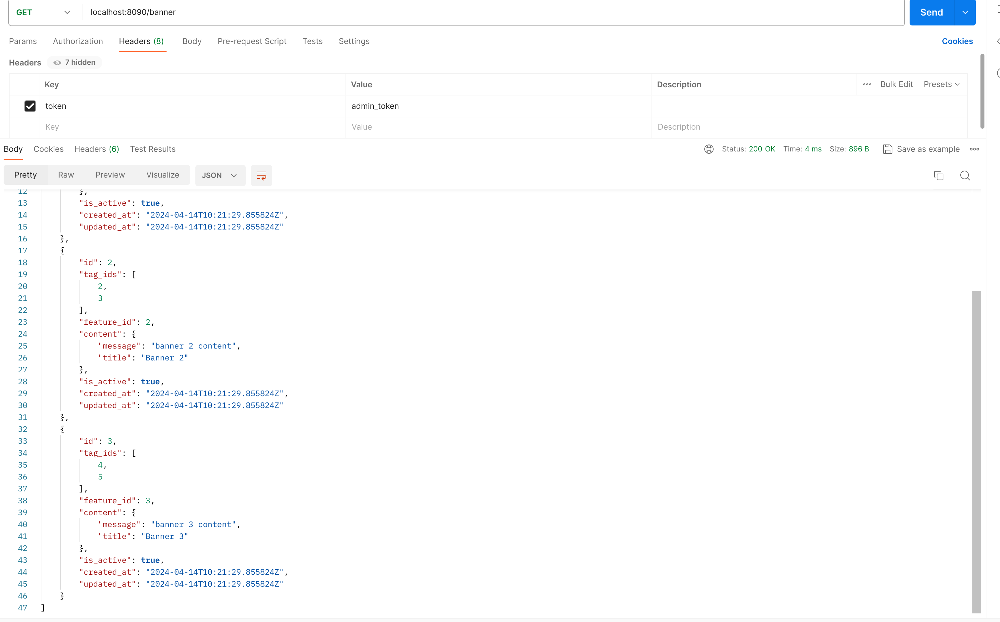

- `Использование параметра use_last_revision. Список баннеров : `

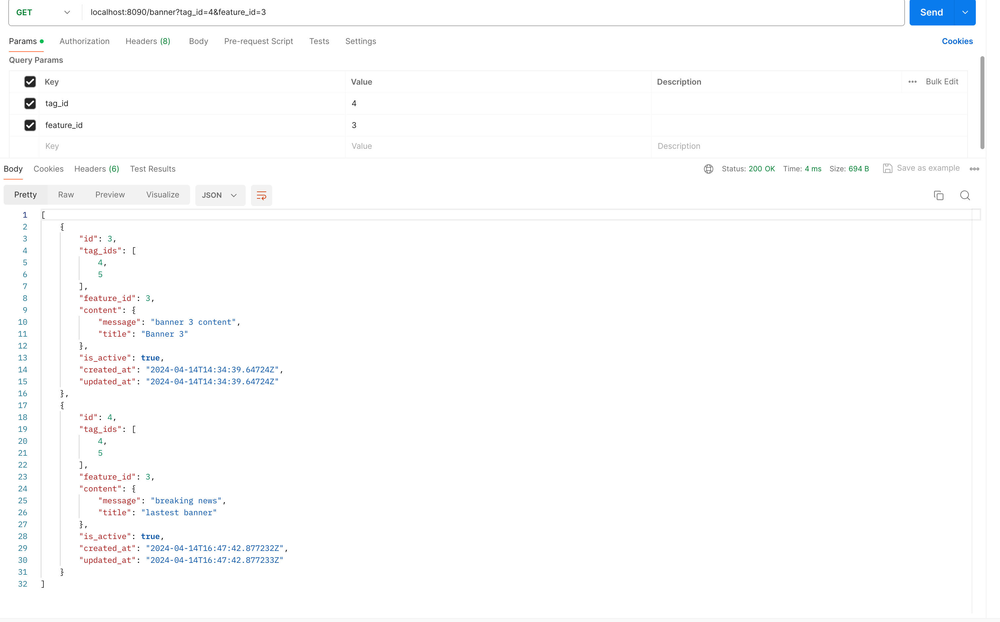

- `Использование параметра use_last_revision. Получаем контент самого последнего баннера : `


- `Использование параметра use_last_revision. Тот же запрос без флага : `

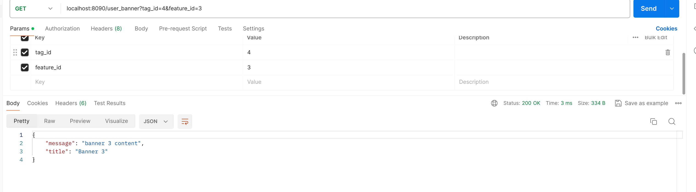


## Insert Template

Шаблон для тела запроса POST /banner

```json
{
    "tag_ids": [4, 5],
    "feature_id": 3,
    "content": {
        "message": "breaking news",
        "title": "lastest banner"
    },
    "is_active": true
}
